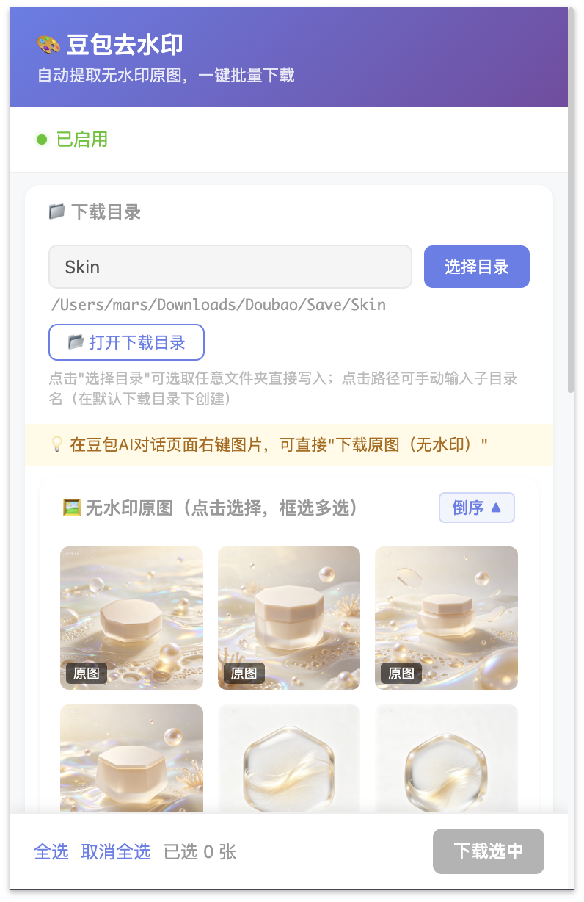
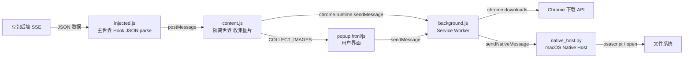

# 🎨 豆包去水印

> 豆包 AI 生图无水印下载 Chrome 扩展 —— 自动提取无水印原图，一键批量下载



---

## ✨ 功能特性

| 功能 | 说明 |
|------|------|
| 🔍 **自动拦截** | Hook `JSON.parse`，实时拦截豆包后端返回的 SSE 数据，自动提取无水印原图 URL |
| 🖼️ **图片网格** | Popup 弹窗以缩略图网格展示所有已生成的无水印原图，支持点击选择和框选多选 |
| ⬇️ **批量下载** | 一键批量下载选中的图片，带进度条和 Toast 通知反馈 |
| 📂 **自定义目录** | 支持 macOS 原生目录选择对话框，可将图片直接保存到任意文件夹 |
| 📋 **右键菜单** | 在豆包页面右键图片可直接「下载原图（无水印）」或「复制无水印图片链接」 |
| 🔄 **智能去重** | 自动去重并只保留每张图片的最高清版本（`image_ori_raw` > `image_ori` > `image_preview` > `image_thumb`） |
| ↕️ **排序切换** | 支持正序/倒序排列图片，方便查找最新或最早的生成图 |

---

## 🏗️ 架构设计



### 三层脚本架构

| 脚本 | 运行世界 | 职责 |
|------|---------|------|
| `injected.js` | 页面主世界 (MAIN) | Hook `JSON.parse`，拦截包含 `creations` 的数据，提取无水印图片 URL，通过 `postMessage` 传给隔离世界 |
| `content.js` | 隔离世界 (ISOLATED) | 接收主世界传来的图片数据，去重并保留最高清版本，处理右键菜单图片信息，响应 Popup 查询 |
| `background.js` | Service Worker | 注册右键菜单、管理图片下载、批量下载、目录选择、Native Messaging 通信、图片数据代理 |

### 通信机制

```
injected.js  ──postMessage──>  content.js  ──chrome.runtime.sendMessage──>  background.js
                                    │                                          │
                                    │<──── GET_STATUS / COLLECT_IMAGES ─────────│
                                    │                                         │
                              popup.js  ──chrome.runtime.sendMessage──>  background.js
                                                                    │
                                                            ┌───────┴───────┐
                                                    chrome.downloads    sendNativeMessage
                                                         │                  │
                                                    Chrome 下载 API    native_host.py
```

---

## 📦 安装

### 前置要求

- **macOS**（Native Messaging Host 的目录选择和文件写入功能依赖 macOS）
- **Google Chrome** 浏览器
- **Python 3**（系统自带即可，Native Messaging Host 需要）

### 步骤

#### 1. 加载 Chrome 扩展

1. 打开 Chrome，访问 `chrome://extensions/`
2. 开启右上角 **开发者模式**
3. 点击 **加载已解压的扩展程序**，选择本项目根目录
4. 加载成功后，记下扩展的 **ID**（在扩展卡片上可见，类似 `abcdefghijklmnopqrstuvwxyz`）

#### 2. 安装 Native Messaging Host

Native Messaging Host 提供以下能力：
- 📂 弹出 macOS 原生目录选择对话框
- 📂 在 Finder 中打开下载目录
- 💾 将图片直接写入用户选择的任意目录（绕过 Chrome 下载 API 的目录限制）

运行安装脚本：

```bash
# 自动检测插件 ID（推荐）
./install_native_host.sh

# 或手动指定插件 ID
./install_native_host.sh <你的扩展ID>
```

安装脚本会：
1. 在 `~/Library/Application Support/DoubaoNativeHost/` 下生成 `native_host.py`
2. 在 `~/Library/Application Support/Google/Chrome/NativeMessagingHosts/` 下注册 `com.doubao.remove.mark.json`
3. 自动清除 macOS `com.apple.provenance` 扩展属性（避免 TCC 权限问题）

> 💡 以后修改 `native_host.py` 后，更新脚本中的 HEREDOC 内容，重新运行 `./install_native_host.sh` 即可同步。

#### 3. 验证安装

1. 打开豆包 AI 对话页面（`https://www.doubao.com/*`）
2. 点击扩展图标，查看 Hook 状态是否为 🟢 已激活
3. 生成图片后，Popup 中应显示无水印原图网格

---

## 🚀 使用方法

### 方式一：Popup 批量下载

1. 在豆包 AI 对话页面，点击浏览器工具栏的扩展图标
2. Popup 中会展示当前页面所有已生成的无水印原图
3. **点击图片**选中/取消选中，或使用**框选**批量选择
4. 点击「全选」/「取消全选」快速操作
5. 点击「下载选中」开始批量下载
6. 下载进度通过顶部进度条和 Toast 通知实时反馈

### 方式二：右键菜单下载

1. 在豆包页面中，对任意图片**右键**
2. 选择「下载原图（无水印）」直接下载
3. 或选择「复制无水印图片链接」获取无水印 URL

### 自定义下载目录

1. Popup 中点击「选择目录」按钮
2. 在弹出的 macOS 原生对话框中选择目标文件夹
3. 下载的图片将直接写入所选目录
4. 点击「打开下载目录」可在 Finder 中查看

---

## 📁 项目结构

```
DoubaoRemoveMark/
├── manifest.json              # Chrome 扩展清单（Manifest V3）
├── background.js              # Service Worker：下载管理、右键菜单、Native Messaging
├── content.js                 # Content Script（隔离世界）：图片收集、去重、右键图片信息
├── injected.js                # 注入脚本（主世界）：Hook JSON.parse 提取图片 URL
├── popup.html                 # Popup 界面 HTML + CSS
├── popup.js                   # Popup 逻辑：图片网格、选择、下载、目录管理
├── native_host.py             # Native Messaging Host（Python3）：目录选择、文件写入、打开目录
├── install_native_host.sh     # 一键安装/同步 Native Host 的 Shell 脚本
├── com.doubao.remove.mark.json # Native Messaging Host 清单（安装后自动生成）
├── icons/                     # 扩展图标
│   ├── icon16.png
│   ├── icon48.png
│   └── icon128.png
└── ReadMeSource/              # README 素材
    └── preview.png            # 预览截图
```

---

## ⚙️ 核心原理

### 无水印 URL 提取

豆包 AI 生图后，后端通过 SSE 流式返回 JSON 数据，其中 `creations` 数组包含多种质量等级的图片 URL：

| 字段 | 说明 | 质量等级 |
|------|------|---------|
| `image_ori_raw.url` | 无水印原图 | ⭐⭐⭐⭐⭐ 最高 |
| `image_ori.url` | 原图（可能有水印） | ⭐⭐⭐⭐ |
| `image_preview.url` | 预览图 | ⭐⭐⭐ |
| `image_thumb.url` | 缩略图 | ⭐⭐ |

扩展 Hook `JSON.parse`，拦截所有包含 `creations` 的 JSON 数据，优先提取 `image_ori_raw.url` 作为下载源。

### URL 去水印转换

对于右键菜单场景，如果 Hook 未捕获到原图数据，扩展还支持将带水印 URL 转换为无水印 URL：

```
~tplv-xxx-downsize_watermark_1080_1080-a.jpeg  →  ~tplv-xxx-image_raw-a.jpeg
~tplv-xxx-pre_watermark-a.jpeg                  →  ~tplv-xxx-image_raw-a.jpeg
~tplv-xxx-dld_watermark-a.jpeg                  →  ~tplv-xxx-image_raw-a.jpeg
```

### Native Messaging 协议

Native Host 支持以下命令：

| 命令 | 参数 | 说明 |
|------|------|------|
| `ping` | — | 诊断测试，返回 Python 环境信息 |
| `open` | `path` | 在 Finder 中打开指定目录 |
| `choose_dir` | `prompt`, `default_location` | 弹出 macOS 原生目录选择对话框 |
| `write_file` | `dir`, `filename`, `data_base64` | 将 base64 数据写入指定目录的文件 |
| `resolve_dir` | `marker_filename`, `search_roots` | 通过探针文件定位目录绝对路径 |

---

## 🔧 权限说明

| 权限 | 用途 |
|------|------|
| `downloads` | 调用 Chrome 下载 API 保存图片 |
| `contextMenus` | 注册右键菜单「下载原图（无水印）」 |
| `storage` | 存储用户自定义下载目录偏好 |
| `scripting` | 动态注入主世界脚本（`injected.js`） |
| `nativeMessaging` | 与 Native Host 通信，实现目录选择和文件写入 |
| `https://*.doubao.com/*` | 仅在豆包域名下运行 Content Script |
| `https://*.byteimg.com/*` | 代理获取字节跳动 CDN 上的图片数据 |

---

## ❓ 常见问题

### Hook 状态显示红色/未激活

- 确认当前页面是 `doubao.com` 的对话页面
- 刷新页面后重试
- 打开浏览器 DevTools Console，查看是否有 `[豆包去水印]` 前缀的日志

### 下载目录选择按钮无反应

- 确认已运行 `./install_native_host.sh` 安装 Native Host
- 在 Popup 中检查 Native Messaging 诊断状态
- 检查 `/tmp/doubao_native_host.log` 日志文件

### macOS 提示「python3 要访问你的下载文件夹」

- 这是 macOS TCC（Transparency, Consent, and Control）安全机制
- 在 **系统设置 → 隐私与安全性 → 文件和文件夹** 中为 Python 授予相应权限
- Native Host 已优化默认目录为用户 Home 目录，尽量避免触发 Downloads 权限弹窗

### 图片下载后找不到文件

- 默认保存到 Chrome 下载目录下的 `豆包无水印图片/` 子文件夹
- 可在 Popup 中点击「打开下载目录」直接在 Finder 中查看
- 使用「选择目录」功能可自定义保存位置

---

## 📜 版本

**v1.1.0**

- ✅ Hook JSON.parse 自动提取无水印原图
- ✅ Popup 图片网格 + 框选多选
- ✅ 批量下载带进度条
- ✅ 右键菜单下载/复制链接
- ✅ 自定义下载目录（macOS Native Host）
- ✅ 智能去重 + 最高清版本保留
- ✅ 正序/倒序排列切换

---

## 📄 许可

本项目仅供学习交流使用，请勿用于商业用途。
